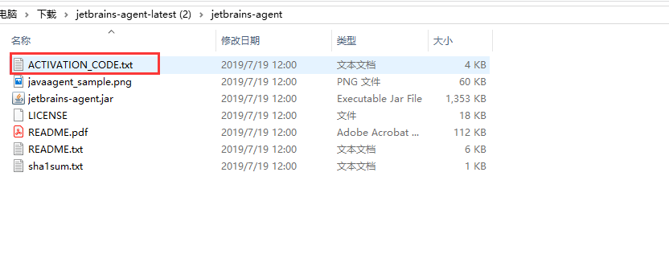
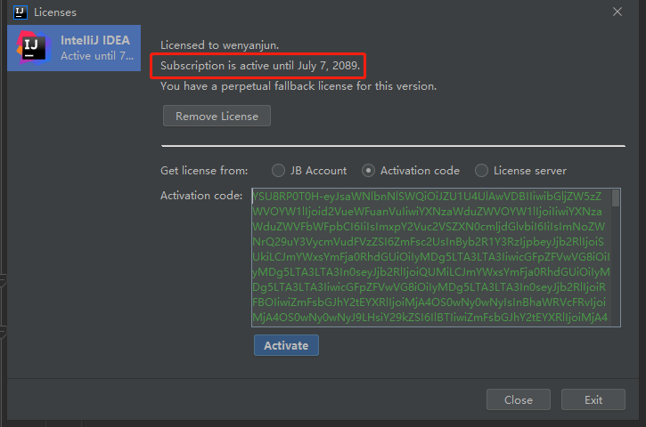
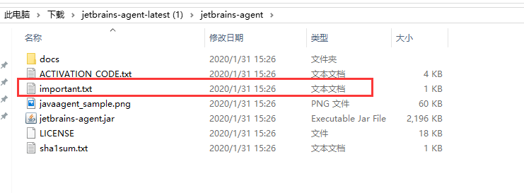

>虽然webStorm,phpStorm以及jetbrains系列的很好用,但是每隔一段时间就需要激活一下,这样太费劲了,今天军哥给大家推荐一个永久激活的办法
>此教程适用于jetbrains 的所有系列的软件
>github [https://github.com/wenyanjun/free-code](https://github.com/wenyanjun/free-code)
>QQ技术交流①群 729987144
>QQ技术交流②群 272712006
>###  jar 包激活 推荐 
>想要永久激活2019 jebrains系列 请下载压缩包 教程都在压缩包里面 https://u18744103.ctfile.com/fs/18744103-388155046
>- 2019.2最新激活 https://545c.com/file/18744103-399875015
>- 2019.2.4 最新激活教程 https://545c.com/file/18744103-409806662
>- 2019.3 最新激活教程 https://545c.com/file/18744103-410586877
>- 2019.3.1 最新激活教程 https://545c.com/file/18744103-414773569
>- 2019.3.1最新 https://545c.com/file/18744103-416120397
>- 2019.3.2最新 https://545c.com/file/18744103-419664636
>- 2019.3.3最新激活教程 https://545c.com/file/18744103-421418144
>- 2019.3.3(拖动破解) https://545c.com/file/18744103-424973548

### 激活码
>- 永久激活码 点击链接  https://545c.com/file/18744103-406652871
>- 永久激活码20191204更新 https://545c.com/file/18744103-411147573
>- 永久激活码20191227更新 https://545c.com/file/18744103-415276627
>- 激活码 2020-01-10 更新 https://545c.com/file/18744103-416965138
>- 激活码 2020-01-12更新 https://545c.com/file/18744103-417224917
>- 激活码 2020-02-19更新 https://545c.com/file/18744103-423187074 

- 1.下载安装软件,去官网下载 http://www.jetbrains.com/products.html?fromMenu
>webStrom  2019.3.0(内部包含激活jar包) [https://545c.com/file/18744103-416966381](https://545c.com/file/18744103-416966381)
>- phpStorm 2019.3(内部包含激活jar包) https://545c.com/file/18744103-416967176
>- idea 2019.3(内部包含激活jar包) https://545c.com/file/18744103-416967427
>- pyCharm 2019.3(内部包含激活jar包)https://545c.com/file/18744103-416968120

### 1.永久激活(以win为例/mac方法一样)
- 1.下载jar包
- 2019.3.3(拖动破解) https://545c.com/file/18744103-424973548
### 2使用方法(傻瓜式破解)
- 1. 先下载压缩包解压后得到`jetbrains-agent.jar`，把它放到你认为合适的文件夹内。
- 2. 启动你的IDE，如果上来就需要注册，选择：试用（Evaluate for free）进入IDE

- 3. 把下载好的jar 拖到编辑器里面

- 4. 弹出一个对话框 点击 `restart`

- 5. 选择离线安装


- 6.破解成功


### 3使用方法 (程序员破解):
 1. 先下载压缩包解压后得到`jetbrains-agent.jar`，把它放到你认为合适的文件夹内。
 2. 启动你的IDE，如果上来就需要注册，选择：试用（Evaluate for free）进入IDE
 3. 点击你要注册的IDE菜单：`"Configure" 或 "Help" -> "Edit Custom VM Options ..."`
    如果提示是否要创建文件，请点"Yes"。
 4. 在打开的vmoptions编辑窗口末行添加：
```
-javaagent:/absolute/path/to/jetbrains-agent.jar
```
> 一定要自己确认好路径(不要使用中文路径)，填错会导致IDE打不开！！！最好使用绝对路径。
	一个vmoptions内只能有一个-javaagent参数。
   ## 示例:
      mac:      -javaagent:/Users/neo/jetbrains-agent.jar
      linux:    -javaagent:/home/neo/jetbrains-agent.jar
      windows:  -javaagent:C:\Users\neo\jetbrains-agent.jar
 5. 重启你的IDE。
 6. 点击IDE菜单` "Help" -> "Register..." 或 "Configure" -> "Manage License..."`

7.选择Activation code方式离线激活，请使用：`ACTIVATION_CODE.txt` 内的注册码激活


- 8.点击`active` 激活成功


激活码 2020-01-10 更新 https://545c.com/file/18744103-416965138
- 9.或者使用我的激活码
```
YSU8RP0T0H-eyJsaWNlbnNlSWQiOiJZU1U4UlAwVDBIIiwibGljZW5zZWVOYW1lIjoid2VueWFuanVuIiwiYXNzaWduZWVOYW1lIjoiIiwiYXNzaWduZWVFbWFpbCI6IiIsImxpY2Vuc2VSZXN0cmljdGlvbiI6IiIsImNoZWNrQ29uY3VycmVudFVzZSI6ZmFsc2UsInByb2R1Y3RzIjpbeyJjb2RlIjoiSUkiLCJmYWxsYmFja0RhdGUiOiIyMDg5LTA3LTA3IiwicGFpZFVwVG8iOiIyMDg5LTA3LTA3In0seyJjb2RlIjoiQUMiLCJmYWxsYmFja0RhdGUiOiIyMDg5LTA3LTA3IiwicGFpZFVwVG8iOiIyMDg5LTA3LTA3In0seyJjb2RlIjoiRFBOIiwiZmFsbGJhY2tEYXRlIjoiMjA4OS0wNy0wNyIsInBhaWRVcFRvIjoiMjA4OS0wNy0wNyJ9LHsiY29kZSI6IlBTIiwiZmFsbGJhY2tEYXRlIjoiMjA4OS0wNy0wNyIsInBhaWRVcFRvIjoiMjA4OS0wNy0wNyJ9LHsiY29kZSI6IkdPIiwiZmFsbGJhY2tEYXRlIjoiMjA4OS0wNy0wNyIsInBhaWRVcFRvIjoiMjA4OS0wNy0wNyJ9LHsiY29kZSI6IkRNIiwiZmFsbGJhY2tEYXRlIjoiMjA4OS0wNy0wNyIsInBhaWRVcFRvIjoiMjA4OS0wNy0wNyJ9LHsiY29kZSI6IkNMIiwiZmFsbGJhY2tEYXRlIjoiMjA4OS0wNy0wNyIsInBhaWRVcFRvIjoiMjA4OS0wNy0wNyJ9LHsiY29kZSI6IlJTMCIsImZhbGxiYWNrRGF0ZSI6IjIwODktMDctMDciLCJwYWlkVXBUbyI6IjIwODktMDctMDcifSx7ImNvZGUiOiJSQyIsImZhbGxiYWNrRGF0ZSI6IjIwODktMDctMDciLCJwYWlkVXBUbyI6IjIwODktMDctMDcifSx7ImNvZGUiOiJSRCIsImZhbGxiYWNrRGF0ZSI6IjIwODktMDctMDciLCJwYWlkVXBUbyI6IjIwODktMDctMDcifSx7ImNvZGUiOiJQQyIsImZhbGxiYWNrRGF0ZSI6IjIwODktMDctMDciLCJwYWlkVXBUbyI6IjIwODktMDctMDcifSx7ImNvZGUiOiJSTSIsImZhbGxiYWNrRGF0ZSI6IjIwODktMDctMDciLCJwYWlkVXBUbyI6IjIwODktMDctMDcifSx7ImNvZGUiOiJXUyIsImZhbGxiYWNrRGF0ZSI6IjIwODktMDctMDciLCJwYWlkVXBUbyI6IjIwODktMDctMDcifSx7ImNvZGUiOiJEQiIsImZhbGxiYWNrRGF0ZSI6IjIwODktMDctMDciLCJwYWlkVXBUbyI6IjIwODktMDctMDcifSx7ImNvZGUiOiJEQyIsImZhbGxiYWNrRGF0ZSI6IjIwODktMDctMDciLCJwYWlkVXBUbyI6IjIwODktMDctMDcifSx7ImNvZGUiOiJSU1UiLCJmYWxsYmFja0RhdGUiOiIyMDg5LTA3LTA3IiwicGFpZFVwVG8iOiIyMDg5LTA3LTA3In1dLCJoYXNoIjoiMTI3OTY4NzcvMCIsImdyYWNlUGVyaW9kRGF5cyI6NywiYXV0b1Byb2xvbmdhdGVkIjpmYWxzZSwiaXNBdXRvUHJvbG9uZ2F0ZWQiOmZhbHNlfQ==-HSfu7EkmAbBghJyleC4kIHxhnIxoBgRU530vuytwdsNLEoXpQ7jWow5j46qnrEZQr8d///E0EsED8rmc8O/wKXlGnmV5dIdgU81/W1PHyWo3lrg+i0z8i2FFUQoMkXo2D7SE17tjyDeIPyrLX5Os918lLQWJE3j2SAFrNMWQWuf7dicTqbaYjQ9Rl54sDJRFdGH39cObBueN+bltQ3KwCLO07gGxp8Ddt9zE8WpBp0pfhUjU8chLxZ9f3Lu/oPlLVceGbeP+ykSIDXlIZGKgX/EgQy25JOegDuM1eG3nqGmAzKeCbH1A0RWBB3FMZDEP2vxUW4ZTjnlWIyJ0E2nBwA==-MIIElTCCAn2gAwIBAgIBCTANBgkqhkiG9w0BAQsFADAYMRYwFAYDVQQDDA1KZXRQcm9maWxlIENBMB4XDTE4MTEwMTEyMjk0NloXDTIwMTEwMjEyMjk0NlowaDELMAkGA1UEBhMCQ1oxDjAMBgNVBAgMBU51c2xlMQ8wDQYDVQQHDAZQcmFndWUxGTAXBgNVBAoMEEpldEJyYWlucyBzLnIuby4xHTAbBgNVBAMMFHByb2QzeS1mcm9tLTIwMTgxMTAxMIIBIjANBgkqhkiG9w0BAQEFAAOCAQ8AMIIBCgKCAQEA5ndaik1GD0nyTdqkZgURQZGW+RGxCdBITPXIwpjhhaD0SXGa4XSZBEBoiPdY6XV6pOfUJeyfi9dXsY4MmT0D+sKoST3rSw96xaf9FXPvOjn4prMTdj3Ji3CyQrGWeQU2nzYqFrp1QYNLAbaViHRKuJrYHI6GCvqCbJe0LQ8qqUiVMA9wG/PQwScpNmTF9Kp2Iej+Z5OUxF33zzm+vg/nYV31HLF7fJUAplI/1nM+ZG8K+AXWgYKChtknl3sW9PCQa3a3imPL9GVToUNxc0wcuTil8mqveWcSQCHYxsIaUajWLpFzoO2AhK4mfYBSStAqEjoXRTuj17mo8Q6M2SHOcwIDAQABo4GZMIGWMAkGA1UdEwQCMAAwHQYDVR0OBBYEFGEpG9oZGcfLMGNBkY7SgHiMGgTcMEgGA1UdIwRBMD+AFKOetkhnQhI2Qb1t4Lm0oFKLl/GzoRykGjAYMRYwFAYDVQQDDA1KZXRQcm9maWxlIENBggkA0myxg7KDeeEwEwYDVR0lBAwwCgYIKwYBBQUHAwEwCwYDVR0PBAQDAgWgMA0GCSqGSIb3DQEBCwUAA4ICAQBonMu8oa3vmNAa4RQP8gPGlX3SQaA3WCRUAj6Zrlk8AesKV1YSkh5D2l+yUk6njysgzfr1bIR5xF8eup5xXc4/G7NtVYRSMvrd6rfQcHOyK5UFJLm+8utmyMIDrZOzLQuTsT8NxFpbCVCfV5wNRu4rChrCuArYVGaKbmp9ymkw1PU6+HoO5i2wU3ikTmRv8IRjrlSStyNzXpnPTwt7bja19ousk56r40SmlmC04GdDHErr0ei2UbjUua5kw71Qn9g02tL9fERI2sSRjQrvPbn9INwRWl5+k05mlKekbtbu2ev2woJFZK4WEXAd/GaAdeZZdumv8T2idDFL7cAirJwcrbfpawPeXr52oKTPnXfi0l5+g9Gnt/wfiXCrPElX6ycTR6iL3GC2VR4jTz6YatT4Ntz59/THOT7NJQhr6AyLkhhJCdkzE2cob/KouVp4ivV7Q3Fc6HX7eepHAAF/DpxwgOrg9smX6coXLgfp0b1RU2u/tUNID04rpNxTMueTtrT8WSskqvaJd3RH8r7cnRj6Y2hltkja82HlpDURDxDTRvv+krbwMr26SB/40BjpMUrDRCeKuiBahC0DCoU/4+ze1l94wVUhdkCfL0GpJrMSCDEK+XEurU18Hb7WT+ThXbkdl6VpFdHsRvqAnhR2g4b+Qzgidmuky5NUZVfEaZqV/g==
```
> PS 如果不想弹框的话把压缩包里面的` important.txt` 放在和jar包一样的位置即可



给个支持微信


> QQ技术交流①群 729987144
> QQ技术交流②群 272712006
> 简书coderYJ
> 微信公众号coderYJ
> 微博coderYJ