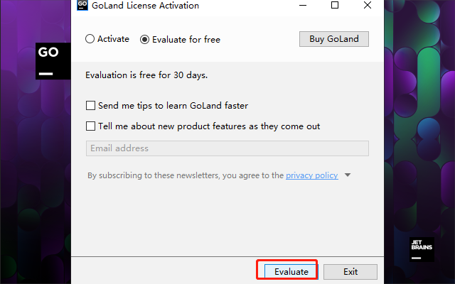
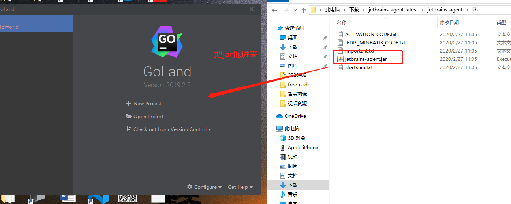
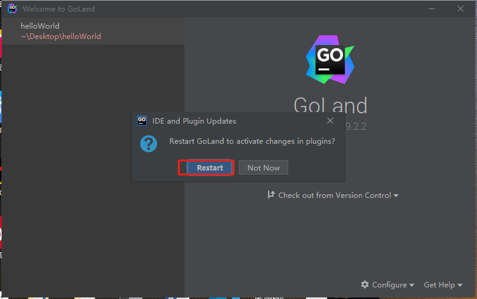
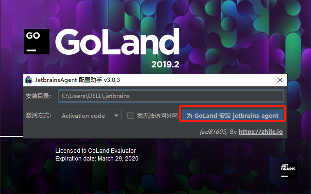
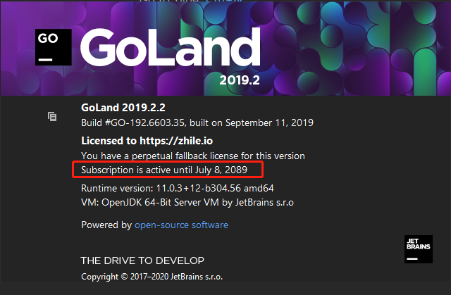

>- 虽然webStorm,phpStorm以及jetbrains系列的很好用,但是每隔一段时间就需要激活一下,这样太费劲了,今天军哥给大家推荐一个永久激活的办法
>- 此教程适用于jetbrains 的所有系列的软件
>- 简书 [https://www.jianshu.com/p/133af2e4fe3f](https://www.jianshu.com/p/133af2e4fe3f)
>- QQ技术交流①群 729987144
>- QQ技术交流②群 272712006
>- QQ技术交流③群 1093476453
### 激活码

> - 2020-04-02激活码 [https://545c.com/file/18744103-434539387](https://545c.com/file/18744103-434539387)
> - 2020-04-08激活码 [https://545c.com/file/18744103-435868693](https://545c.com/file/18744103-435868693)
> - 2020-04-11激活码 https://545c.com/file/18744103-436257653
> - 2020-04-11激活码备用地址 https://t.cn/A6wLpNq3 密码：h70z
- 1.下载安装软件
>- webStrom  2019.3.0(内部包含激活jar包) [https://545c.com/file/18744103-416966381](https://545c.com/file/18744103-416966381)
>- phpStorm 2019.3(内部包含激活jar包) https://545c.com/file/18744103-416967176
>- idea 2019.3(内部包含激活jar包) https://545c.com/file/18744103-416967427
>- pyCharm 2019.3(内部包含激活jar包)https://545c.com/file/18744103-416968120
>------202000000
>- idea 2020.1 https://545c.com/file/18744103-436257652
>- webStrom 2020.1 https://545c.com/file/18744103-436258792
>- pycharm 2020.1 https://545c.com/file/18744103-436262171
### 1.永久激活(以win为例/mac方法一样)
- 1.下载jar包
- 2019.3.3(拖动破解 此破解包可以破解2019.3.3之前的) https://545c.com/file/18744103-424973548
-  2020.1 拖拽破解 [https://545c.com/file/18744103-436204254](https://links.jianshu.com/go?to=https%3A%2F%2F545c.com%2Ffile%2F18744103-436204254) 
-  2020.1拖拽破解备用地址 [https://t.cn/A6wLN8zx](https://links.jianshu.com/go?to=https%3A%2F%2Ft.cn%2FA6wLN8zx) 密码：vz5f 
### 2使用方法(傻瓜式破解)
- 1. 先下载压缩包解压后得到`jetbrains-agent.jar`，把它放到你认为合适的文件夹内。
- 2. 启动你的IDE，如果上来就需要注册，选择：试用（Evaluate for free）进入IDE

> 如果无法试用: 下载这个脚本 [https://545c.com/file/18744103-426684754](https://545c.com/file/18744103-426684754)
- 3. 把下载好的jar 拖到编辑器里面

- 4. 弹出一个对话框 点击 `restart`

- 5. 选择离线安装

- 6.破解成功

## 给个支持微信

> QQ技术交流①群 729987144
> QQ技术交流②群 272712006
> 简书coderYJ
> 微信公众号coderYJ
> 微博coderYJ

