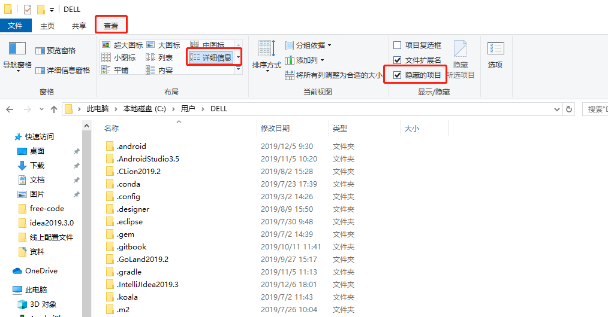

# free-code
提供激活码和jar激活方式
>虽然webStorm,phpStorm以及jetbrains系列的很好用,但是每隔一段时间就需要激活一下,这样太费劲了,今天军哥给大家推荐一个永久激活的办法
此教程适用于jetbrains 的所有系列的软件

###  jar 包激活 推荐 
>想要永久激活2019 jebrains系列 请下载压缩包 教程都在压缩包里面 https://u18744103.ctfile.com/fs/18744103-388155046
>- 2019.2最新激活 https://545c.com/file/18744103-399875015
>- 2019.2.4 最新激活教程 https://545c.com/file/18744103-409806662
>- 2019.3 最新激活教程 https://545c.com/file/18744103-410586877
>- 2019.3.1 最新激活教程 https://545c.com/file/18744103-414773569
>- 2019.3.1最新 https://545c.com/file/18744103-416120397

### 激活码
>永久激活码 点击链接  https://545c.com/file/18744103-406652871
>- 永久激活码20191204更新 https://545c.com/file/18744103-411147573
>- 永久激活码20191227更新 https://545c.com/file/18744103-415276627
>- 激活码 2020-01-10 更新 https://545c.com/file/18744103-416965138
>- 激活码 2020-01-12更新 https://545c.com/file/18744103-417224917

- 1.下载安装软件,去官网下载 http://www.jetbrains.com/products.html?fromMenu
>- webStrom  2019.3.0(内部包含激活jar包) [https://545c.com/file/18744103-416966381](https://545c.com/file/18744103-416966381)
>- phpStorm  2019.3(内部包含激活jar包) https://545c.com/file/18744103-416967176
>- idea 2019.3(内部包含激活jar包) https://545c.com/file/18744103-416967427
>- pyCharm 2019.3(内部包含激活jar包)https://545c.com/file/18744103-416968120
- 2.找到路径 
  - win ```C:\Windows\System32\drivers\etc ```
  - Linux和mac的hosts文件路径为：```/etc/hosts``` 
> mac下的host文件要先拷贝出来修改修改完了再拷贝进去,不能直接修改
   如果遇到权限问题，可将hosts文件先复制出来修改后再覆盖原来的即可。
- 3.找到 hosts文件
  - 在hosts 中最后一行添加
```
0.0.0.0 account.jetbrains.com
0.0.0.0 www.jetbrains.com
```
- 3.激活软件 在弹出的框里面选择  code然后填写这个
点击获取激活码 [http://idea.medeming.com/jet/](http://idea.medeming.com/jet/)

> license地址  http://jetbrains-license-server
> 如果想更改 lincense 的名称 请去这个网站 [https://zhile.io/custom-license.html](https://zhile.io/custom-license.html)
> 更换皮肤 [http://www.color-themes.com/?view=index](http://www.color-themes.com/?view=index)

- 4.完美激活

## 第二种激活方法   
### 1.永久激活(以win为例/mac方法一样)
- 1.下载jar包
去我的百度网盘下载最新的jar包
- 破解包下载地址 https://u18744103.pipipan.com/fs/18744103-388158585
- 2019.2最新激活 https://545c.com/file/18744103-399875015
- 2019.2.4 最新激活教程 https://545c.com/file/18744103-409806662
- 2019.3 最新激活教程 https://545c.com/file/18744103-410586877
- 2019.3.1 最新激活教程 https://545c.com/file/18744103-414773569
- 2.找到安装目录里面的bin> 然后把刚刚下载jar包放进去

- 2.1 打开隐藏文件夹 win10为例 `查看->> 详细信息--> 隐藏项目`


- 3.修改这个目录`C:\Users\DELL\.WebStorm2019.3\config`下面的文件 `WebStorm.exe.vmoptions` 和`WebStorm64.exe.vmoptions`，这两个文件一个是32位的，一个是64位的，建议同步修改。

> ps `C:\Users\DELL\.WebStorm2019.3\config`  DELL 是你的用户

分别打开文件 在最后加上一行代码
```
-javaagent:D:\Program Files\JetBrains\WebStorm 2019.3\bin\jetbrains-agent.jar
```
> ps 路径改成你自己的
- 例如

- 4.打开webstorm 点击linstion server然后输入 
```html
http://jetbrains-license-server
```

- 5.点击`active` 激活成功
激活码 2020-01-10 更新 https://545c.com/file/18744103-416965138
- 6.如果激活不成功 把code放进去
```
YSU8RP0T0H-eyJsaWNlbnNlSWQiOiJZU1U4UlAwVDBIIiwibGljZW5zZWVOYW1lIjoid2VueWFuanVuIiwiYXNzaWduZWVOYW1lIjoiIiwiYXNzaWduZWVFbWFpbCI6IiIsImxpY2Vuc2VSZXN0cmljdGlvbiI6IiIsImNoZWNrQ29uY3VycmVudFVzZSI6ZmFsc2UsInByb2R1Y3RzIjpbeyJjb2RlIjoiSUkiLCJmYWxsYmFja0RhdGUiOiIyMDg5LTA3LTA3IiwicGFpZFVwVG8iOiIyMDg5LTA3LTA3In0seyJjb2RlIjoiQUMiLCJmYWxsYmFja0RhdGUiOiIyMDg5LTA3LTA3IiwicGFpZFVwVG8iOiIyMDg5LTA3LTA3In0seyJjb2RlIjoiRFBOIiwiZmFsbGJhY2tEYXRlIjoiMjA4OS0wNy0wNyIsInBhaWRVcFRvIjoiMjA4OS0wNy0wNyJ9LHsiY29kZSI6IlBTIiwiZmFsbGJhY2tEYXRlIjoiMjA4OS0wNy0wNyIsInBhaWRVcFRvIjoiMjA4OS0wNy0wNyJ9LHsiY29kZSI6IkdPIiwiZmFsbGJhY2tEYXRlIjoiMjA4OS0wNy0wNyIsInBhaWRVcFRvIjoiMjA4OS0wNy0wNyJ9LHsiY29kZSI6IkRNIiwiZmFsbGJhY2tEYXRlIjoiMjA4OS0wNy0wNyIsInBhaWRVcFRvIjoiMjA4OS0wNy0wNyJ9LHsiY29kZSI6IkNMIiwiZmFsbGJhY2tEYXRlIjoiMjA4OS0wNy0wNyIsInBhaWRVcFRvIjoiMjA4OS0wNy0wNyJ9LHsiY29kZSI6IlJTMCIsImZhbGxiYWNrRGF0ZSI6IjIwODktMDctMDciLCJwYWlkVXBUbyI6IjIwODktMDctMDcifSx7ImNvZGUiOiJSQyIsImZhbGxiYWNrRGF0ZSI6IjIwODktMDctMDciLCJwYWlkVXBUbyI6IjIwODktMDctMDcifSx7ImNvZGUiOiJSRCIsImZhbGxiYWNrRGF0ZSI6IjIwODktMDctMDciLCJwYWlkVXBUbyI6IjIwODktMDctMDcifSx7ImNvZGUiOiJQQyIsImZhbGxiYWNrRGF0ZSI6IjIwODktMDctMDciLCJwYWlkVXBUbyI6IjIwODktMDctMDcifSx7ImNvZGUiOiJSTSIsImZhbGxiYWNrRGF0ZSI6IjIwODktMDctMDciLCJwYWlkVXBUbyI6IjIwODktMDctMDcifSx7ImNvZGUiOiJXUyIsImZhbGxiYWNrRGF0ZSI6IjIwODktMDctMDciLCJwYWlkVXBUbyI6IjIwODktMDctMDcifSx7ImNvZGUiOiJEQiIsImZhbGxiYWNrRGF0ZSI6IjIwODktMDctMDciLCJwYWlkVXBUbyI6IjIwODktMDctMDcifSx7ImNvZGUiOiJEQyIsImZhbGxiYWNrRGF0ZSI6IjIwODktMDctMDciLCJwYWlkVXBUbyI6IjIwODktMDctMDcifSx7ImNvZGUiOiJSU1UiLCJmYWxsYmFja0RhdGUiOiIyMDg5LTA3LTA3IiwicGFpZFVwVG8iOiIyMDg5LTA3LTA3In1dLCJoYXNoIjoiMTI3OTY4NzcvMCIsImdyYWNlUGVyaW9kRGF5cyI6NywiYXV0b1Byb2xvbmdhdGVkIjpmYWxzZSwiaXNBdXRvUHJvbG9uZ2F0ZWQiOmZhbHNlfQ==-HSfu7EkmAbBghJyleC4kIHxhnIxoBgRU530vuytwdsNLEoXpQ7jWow5j46qnrEZQr8d///E0EsED8rmc8O/wKXlGnmV5dIdgU81/W1PHyWo3lrg+i0z8i2FFUQoMkXo2D7SE17tjyDeIPyrLX5Os918lLQWJE3j2SAFrNMWQWuf7dicTqbaYjQ9Rl54sDJRFdGH39cObBueN+bltQ3KwCLO07gGxp8Ddt9zE8WpBp0pfhUjU8chLxZ9f3Lu/oPlLVceGbeP+ykSIDXlIZGKgX/EgQy25JOegDuM1eG3nqGmAzKeCbH1A0RWBB3FMZDEP2vxUW4ZTjnlWIyJ0E2nBwA==-MIIElTCCAn2gAwIBAgIBCTANBgkqhkiG9w0BAQsFADAYMRYwFAYDVQQDDA1KZXRQcm9maWxlIENBMB4XDTE4MTEwMTEyMjk0NloXDTIwMTEwMjEyMjk0NlowaDELMAkGA1UEBhMCQ1oxDjAMBgNVBAgMBU51c2xlMQ8wDQYDVQQHDAZQcmFndWUxGTAXBgNVBAoMEEpldEJyYWlucyBzLnIuby4xHTAbBgNVBAMMFHByb2QzeS1mcm9tLTIwMTgxMTAxMIIBIjANBgkqhkiG9w0BAQEFAAOCAQ8AMIIBCgKCAQEA5ndaik1GD0nyTdqkZgURQZGW+RGxCdBITPXIwpjhhaD0SXGa4XSZBEBoiPdY6XV6pOfUJeyfi9dXsY4MmT0D+sKoST3rSw96xaf9FXPvOjn4prMTdj3Ji3CyQrGWeQU2nzYqFrp1QYNLAbaViHRKuJrYHI6GCvqCbJe0LQ8qqUiVMA9wG/PQwScpNmTF9Kp2Iej+Z5OUxF33zzm+vg/nYV31HLF7fJUAplI/1nM+ZG8K+AXWgYKChtknl3sW9PCQa3a3imPL9GVToUNxc0wcuTil8mqveWcSQCHYxsIaUajWLpFzoO2AhK4mfYBSStAqEjoXRTuj17mo8Q6M2SHOcwIDAQABo4GZMIGWMAkGA1UdEwQCMAAwHQYDVR0OBBYEFGEpG9oZGcfLMGNBkY7SgHiMGgTcMEgGA1UdIwRBMD+AFKOetkhnQhI2Qb1t4Lm0oFKLl/GzoRykGjAYMRYwFAYDVQQDDA1KZXRQcm9maWxlIENBggkA0myxg7KDeeEwEwYDVR0lBAwwCgYIKwYBBQUHAwEwCwYDVR0PBAQDAgWgMA0GCSqGSIb3DQEBCwUAA4ICAQBonMu8oa3vmNAa4RQP8gPGlX3SQaA3WCRUAj6Zrlk8AesKV1YSkh5D2l+yUk6njysgzfr1bIR5xF8eup5xXc4/G7NtVYRSMvrd6rfQcHOyK5UFJLm+8utmyMIDrZOzLQuTsT8NxFpbCVCfV5wNRu4rChrCuArYVGaKbmp9ymkw1PU6+HoO5i2wU3ikTmRv8IRjrlSStyNzXpnPTwt7bja19ousk56r40SmlmC04GdDHErr0ei2UbjUua5kw71Qn9g02tL9fERI2sSRjQrvPbn9INwRWl5+k05mlKekbtbu2ev2woJFZK4WEXAd/GaAdeZZdumv8T2idDFL7cAirJwcrbfpawPeXr52oKTPnXfi0l5+g9Gnt/wfiXCrPElX6ycTR6iL3GC2VR4jTz6YatT4Ntz59/THOT7NJQhr6AyLkhhJCdkzE2cob/KouVp4ivV7Q3Fc6HX7eepHAAF/DpxwgOrg9smX6coXLgfp0b1RU2u/tUNID04rpNxTMueTtrT8WSskqvaJd3RH8r7cnRj6Y2hltkja82HlpDURDxDTRvv+krbwMr26SB/40BjpMUrDRCeKuiBahC0DCoU/4+ze1l94wVUhdkCfL0GpJrMSCDEK+XEurU18Hb7WT+ThXbkdl6VpFdHsRvqAnhR2g4b+Qzgidmuky5NUZVfEaZqV/g==
```
> 交流QQ群 729987144
> 简书coderYJ
> 微信公众号coderYJ
> 微博coderYJ
